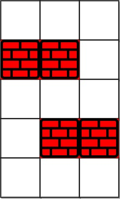
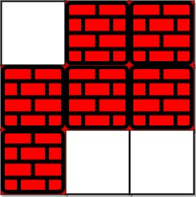

# 1293. Shortest Path in a Grid with Obstacles Elimination - Difícil

## Problema:
> 
Você é dado uma matriz inteira grid de tamanho m x n, onde cada célula pode ser:
- 0: uma célula vazia.
- 1: um obstáculo.

Você pode mover-se para cima, baixo, esquerda ou direita de uma célula vazia para outra.
Retorne o menor número de passos necessários para ir do canto superior esquerdo (0, 0) ao canto inferior direito (m-1, n-1), dado que você pode eliminar até k obstáculos.
Se não for possível alcançar o destino, retorne -1.

## Restrições:
- m==len(grid)
- n==len(grid[0])
- 1≤m,n≤40
- 1≤k≤m×n
- Cada célula de grid[i][j] é 0 ou 1.
- grid[0][0]==grid[m−1][n−1]==0.

## Exemplos:

### Exemplo 1:

<div style="text-align: center;">
    
</div>
</br>

Entrada: 

****
```
grid = [[0,0,0],[1,1,0],[0,0,0],[0,1,1],[0,0,0]], k = 1
```

Saída:

****
```
6
```

Explicação:

O menor caminho sem eliminar obstáculos é 10 passos.
Com a eliminação de um obstáculo na posição (3, 2), o menor caminho é reduzido para 6 passos. O caminho é:

(0,0)→(0,1)→(0,2)→(1,2)→(2,2)→(3,2)→(4,2)

### Exemplo 2:

<div style="text-align: center;">
    
</div>
</br>

Entrada: 

****
```
grid = [[0,1,1],[1,1,1],[1,0,0]], k = 1
```

Saída:

****
```
-1
```

Explicação:
Não é possível alcançar o destino, pois seriam necessários pelo menos 2 eliminações de obstáculos, e 
k = 1.

## Solução proposta:
A solução utiliza o algoritmo de Dijkstra adaptado para grids, onde cada estado é representado pela posição atual, o número de obstáculos eliminados até o momento e o número de passos já dados.

Estratégia:
- Usamos uma fila de prioridade (min-heap) para processar os estados em ordem de passos.
- Cada estado contém: (número de passos, x, y, obstáculos eliminados).
- Mantemos um registro de células visitadas, considerando o número de obstáculos eliminados, para evitar revisitas ineficientes.

```
import heapq

class Solution(object):
    def shortestPath(self, grid, k):
        """
        :type grid: List[List[int]]
        :type k: int
        :rtype: int
        """
        m, n = len(grid), len(grid[0])
        
        # Fila de prioridade (min-heap)
        # Elemento da fila: (distância, x, y, obstáculos eliminados)
        heap = [(0, 0, 0, 0)]  # Começamos com a posição (0, 0), 0 passos, 0 obstáculos eliminados
        # Visitação: uma matriz para guardar o menor número de obstáculos eliminados para um par (x, y)
        visitado = [[[float('inf')] * (k + 1) for _ in range(n)] for _ in range(m)]
        visitado[0][0][0] = 0
        
        # Direções de movimento: Cima, Baixo, Esquerda, Direita
        direcoes = [(-1, 0), (1, 0), (0, -1), (0, 1)]
        
        while heap:
            passos, x, y, obstaculos = heapq.heappop(heap)
            
            # Se chegamos no final, retornamos a distância
            if x == m - 1 and y == n - 1:
                return passos
            
            # Verificar as 4 direções
            for dx, dy in direcoes:
                nx, ny = x + dx, y + dy
                
                # Verifica se a nova posição está dentro dos limites da matriz
                if 0 <= nx < m and 0 <= ny < n:
                    novos_obstaculos = obstaculos + grid[nx][ny]
                    
                    # Se não houver mais obstáculos ou se podemos eliminar um obstáculo
                    if novos_obstaculos <= k and visitado[nx][ny][novos_obstaculos] > passos + 1:
                        visitado[nx][ny][novos_obstaculos] = passos + 1
                        heapq.heappush(heap, (passos + 1, nx, ny, novos_obstaculos))
        
        # Se não foi possível alcançar o destino
        return -1

if __name__ == "__main__":
    solution = Solution()
    
    # Exemplo 1
    grid1 = [[0,0,0],[1,1,0],[0,0,0],[0,1,1],[0,0,0]]
    k1 = 1
    print("Exemplo 1:", solution.shortestPath(grid1, k1))

    # Exemplo 2
    grid2 = [[0,1,1],[1,1,1],[1,0,0]]
    k2 = 1
    print("Exemplo 2:", solution.shortestPath(grid2, k2))
```
