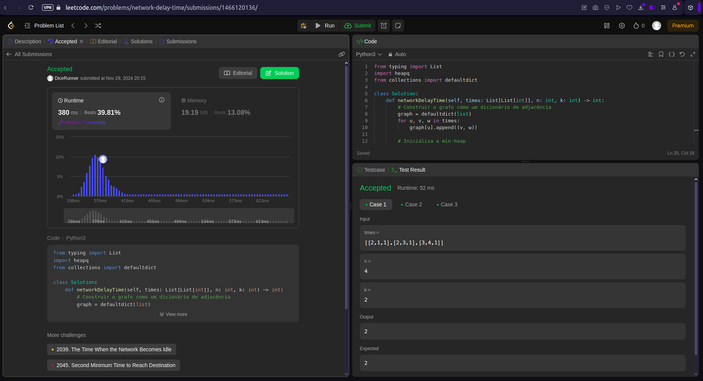
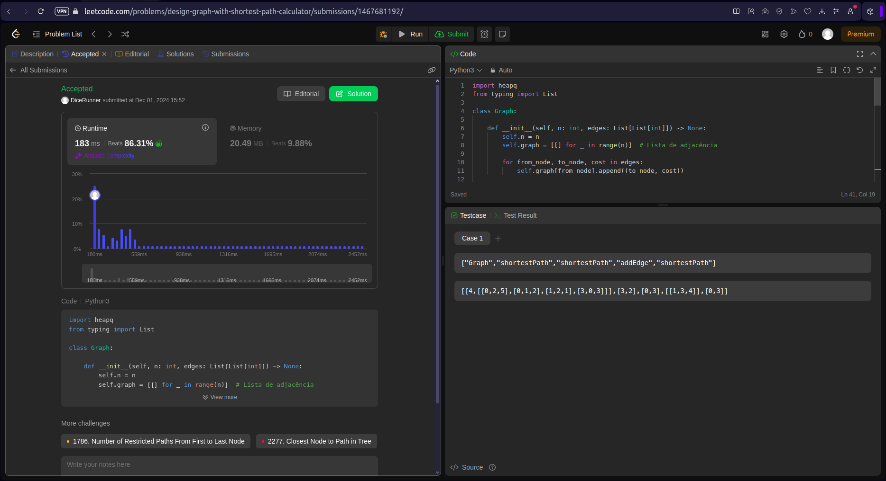

# Grafos2_LeetCodeProblem

**Número da Lista**: X<br>
**Conteúdo da Disciplina**: Grafos 2<br>

## Alunos
|Matrícula | Aluno |
| -- | -- |
| 22/1007869  |  Artur Henrique Holz Bartz |
| 22/1008024  |  Eduardo Matheus dos Santos Sandes |

## Sobre 
O projeto consiste em resolver 4 questões da plataforma LeetCode, sendo duas dífíceis e duas médias. A definição de fácil, médio e difícil é concebida pela plataforma.

Questões Implementadas:
Questão 1584. Min Cost to Connect All Points (Dificuldade: Média). Disponível em : (https://leetcode.com/problems/min-cost-to-connect-all-points/description/);<br>
Questão 1293. Shortest Path in a Grid with Obstacles Elimination (Dificuldade : Difícil). Disponível em : (https://leetcode.com/problems/shortest-path-in-a-grid-with-obstacles-elimination/description/);<br>

Para o desenvolvimento da questão média 1584 foi utilizado o algoritmo de Prim. Já para o desenvolvimento da questão difícil 1293 foi utilizado o algoritmo de Dijkstra. Em ambos os casos a linguagem utilizada foi Python e, além disso, houve a utilização dos algoritmos abordados em sala de aula com pequenas modificações para estarem de acordo com a solução do problema proposto, porém mantendo-se dentro do conteúdo proposto em sala de aula.

## Screenshots
Screenshot da Questão 1584:<br>

Screenshot da Questão 1293:<br>

Screenshot da Questão 743:<br>

Screenshot da Questão 2642:<br>


## Instalação 
**Linguagem**: Python (Questões 1293 e 1584).<br>
**Framework**: Não há frameworks para este projeto.<br>
Para a execução do projeto deve ser instalado o python 3.11.4 ou superior.
Descreva os pré-requisitos para rodar o seu projeto e os comandos necessários.

## Uso 
Explique como usar seu projeto caso haja algum passo a passo após o comando de execução.<br>
Para rodar as questões 743, 1584 e 1293 deste projeto, basta entrar na raiz do projeto e executar o arquivo referente a questão que se deseja avaliar, por exemplo:
```
python 1584.MinCostToConnectAllPoints.py
```
```
python 1293.ShortestPathInAGridWithObstaclesElimination.py
```
```
python 743.NetworkDelayTime.py
```
```
python 2642.DesignGraphWithShortestPathCalculator.py
```

## Outros 
Quaisquer outras informações sobre seu projeto podem ser descritas abaixo.<br>
Desconsiderar a função </br>main()<br> dos arquivos .py ao tentar submeter ao leetcode. Esta função foi implementada apenas com o intuito de testar casos base.

## Vídeo
Disponível em: (link)


