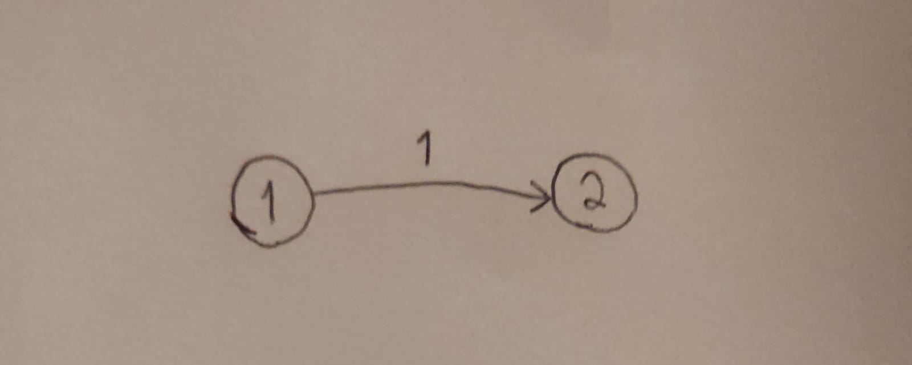

# 743. Network Delay Time - Média 2

## Problema:
> Seja uma rede de n nós (rotulados de 1 a n) e uma lista de tempos, que são os tempos de viagem representados como arestas direcionadas, onde times[i] = (ui, vi, wi), sendo ui o nó de origem, vi o nó de destino e wi o tempo que leva para um sinal viajar do nó de origem para o nó de destino.

> É enviado um sinal de um nó específico k. Retorne o tempo mínimo necessário para que todos os n nós recebam o sinal. Se for impossível para todos os n nós receberem o sinal, retorne -1.

## Restrições:
- 1 <= k <= n <= 100
- 1 <= times.length <= 6000
- times[i].length == 3
- 1 <= ui, vi <= n
- ui != vi
- 0 <= wi <= 100
- Todos os pares (ui, vi) são únicos (ou seja, sem arestas múltiplas).

## Exemplos:

### Exemplo 1:

    

 

Entrada: 

**times = [[2,1,1],[2,3,1],[3,4,1]], n = 4, k = 2**

Saída:

**2**

Explicação:
> - Saindo do nó 2, o sinal atingiria os nós {1, 3} em tempo 1 e chegaria ao nó quatro em tempo 2.

### Exemplo 2:

    

 

Entrada: 

**times = [[1,2,1]], n = 2, k = 1**

Saída:

**1**

Explicação:
> - Saindo do nó 1, o sinal atingiria os nós {2} em tempo 1.

### Exemplo 3:

    

 

Entrada: 

**Input: times = [[1,2,1]], n = 2, k = 2**

Saída:

**-1**

Explicação:
> - Saindo do nó 2, o sinal não chegaria a nenhum outro vértice pois não existem arestas saindo de 2.

## Solução proposta: